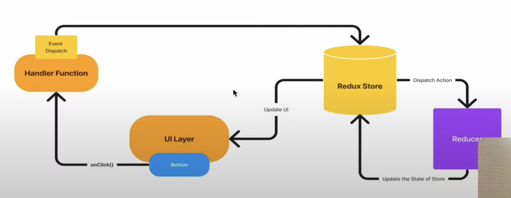

---
## 🧱 Redux Architecture Overview

Think of Redux as a **single source of truth (store)** that manages the entire state of your application in a **predictable way**.
---

### 🔁 Redux Data Flow (Unidirectional)

```plaintext
   UI (React Component)
        ↓
   dispatch(action)
        ↓
     Reducer
        ↓
    New State
        ↓
   UI updates (via useSelector)
```

---

## 🏗️ Key Building Blocks

- **Store**: Holds the entire state tree of your application.
- **Action**: Plain JS object that describes _what happened_.
- **Reducer**: A pure function that takes the current state and an action, then returns a **new state**.
- **Dispatch**: Sends an action to the reducer.
- **Selector**: Gets data from the store into your component.
- **Provider**: Wraps your app and makes the store available everywhere.

---



## 🧩 Redux Toolkit Simplifies Everything

Instead of writing boilerplate:

- You use `createSlice()` to make actions and reducers
- You use `configureStore()` to set up the Redux store

---

## 🖼️ Architectural Flow (Redux Toolkit Example)

```jsx
<App />                      // React Root Component
  └── <Provider store={store}>     // Provides Redux store to entire app
        └── <YourComponent />      // Uses useSelector/useDispatch
```

---

## 🧪 Flashcard Example Breakdown

### 1. **State in Store**

```js
flashcards: [
  { id: 1, question: '...', answer: '...', flipped: false, status: 'review' },
  ...
]
```

### 2. **Actions**

```js
flipCard(id);
markAsKnown(id);
filterByStatus("review");
```

### 3. **Reducer**

```js
flipCard: (state, action) => {
  const card = state.find((card) => card.id === action.payload);
  card.flipped = !card.flipped;
};
```

### 4. **Component Dispatches Action**

```js
const dispatch = useDispatch();
dispatch(flipCard(card.id));
```

### 5. **Component Renders Updated State**

```js
const flashcards = useSelector((state) => state.flashcards);
```

---

## 🧠 One-Liner Summary:

> Redux gives you a **central brain** (store) where you describe **what happened** (action), and it tells **how the state should change** (reducer), so your app can **respond automatically**.

---

Would you like a visual diagram of this Redux architecture or a full working code example for the Flashcard app using Redux Toolkit?
Sure! Here’s a **clear, step-by-step explanation** of Redux architecture with a simple diagram and breakdown:

---

# 🏗️ Redux Architecture — Clear Overview

---

### 1. **Store**

- The **single source of truth** for your app’s state.
- Holds all data in one big JavaScript object.

---

### 2. **Actions**

- Plain JavaScript objects describing _what happened_.
- Must have a `type` field, e.g. `{ type: 'ADD_TODO', payload: {...} }`.
- Created by **action creators** (functions that return actions).

---

### 3. **Reducers**

- Pure functions that take the **current state** and an **action** as inputs.
- They **return a new state** (immutable update).
- Example: `(state, action) => newState`.

---

### 4. **Dispatch**

- The method used to send an action to the store.
- Example: `store.dispatch({ type: 'ADD_TODO', payload: todo })`.

---

### 5. **Selectors**

- Functions that **extract and return** specific parts of the state for components.

---

### 6. **React-Redux `Provider`**

- Wraps your React app and **makes the Redux store available** to all components.

---

### 7. **Components**

- Use `useSelector` to **read state** from the store.
- Use `useDispatch` to **send actions**.

---

# 🔄 Redux Data Flow (Unidirectional)

```plaintext
   Component (User Interaction)
        ↓
   Dispatch Action
        ↓
     Reducer updates State
        ↓
   Store holds New State
        ↓
   Component re-renders with new state
```

---

# 🖼️ Simple Visual Diagram

```
[ React Component ]
       |
       v
[ dispatch(action) ]  -->  [ Reducer ] --> [ New State ]
       |                                  |
       |                                  v
       |---------------------------> [ Store ]
                                         |
                                         v
                                [ useSelector reads state ]
                                         |
                                         v
                                [ React Component updates ]
```

---

# Example Redux Toolkit Setup for Flashcards

```js
import { createSlice, configureStore } from "@reduxjs/toolkit";

// Slice defines state + reducers + actions
const flashcardsSlice = createSlice({
  name: "flashcards",
  initialState: [
    {
      id: 1,
      question: "What is Redux?",
      answer: "State container",
      flipped: false,
      status: "review",
    },
  ],
  reducers: {
    flipCard: (state, action) => {
      const card = state.find((c) => c.id === action.payload);
      if (card) card.flipped = !card.flipped;
    },
    markAsKnown: (state, action) => {
      const card = state.find((c) => c.id === action.payload);
      if (card) card.status = "known";
    },
  },
});

const store = configureStore({
  reducer: { flashcards: flashcardsSlice.reducer },
});

export const { flipCard, markAsKnown } = flashcardsSlice.actions;
export default store;
```

---

# Summary

- **Store**: Holds the entire app state.
- **Action**: Describes _what happened_.
- **Reducer**: Updates state based on the action.
- **Dispatch**: Sends an action to the reducer.
- **Selector**: Reads specific parts of the state.
- **Provider**: Makes the store available to the React tree.
- **React Component**: Reads state and dispatches actions.

---

If you'd like, I can also provide a **simple sample React + Redux app code** with this architecture! Just ask!
